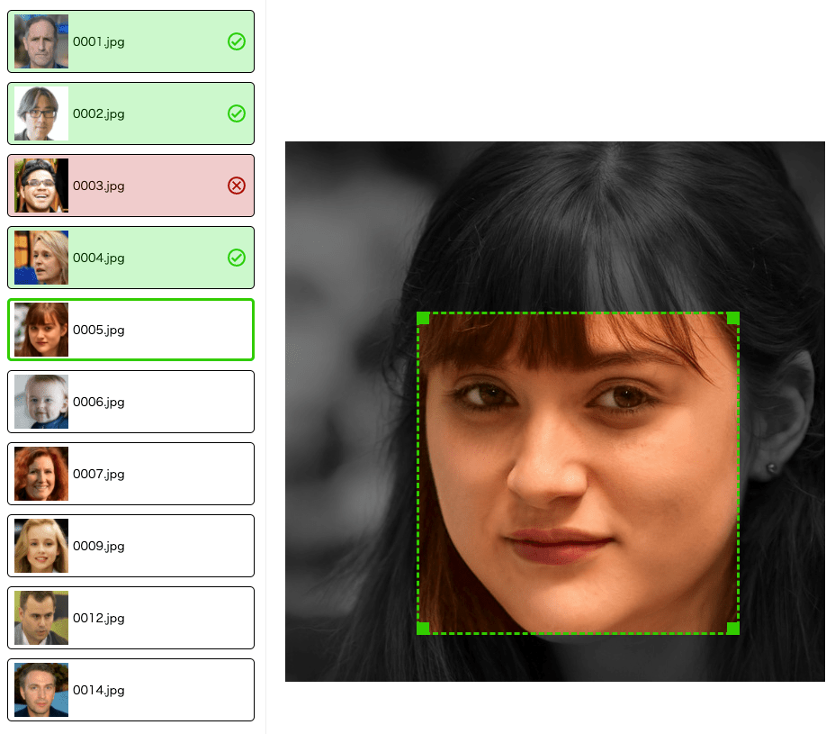

# image-classifier



## Overview

Classify and resize image files for machine learning.

- Efficiantly classify images just by pressing ENTER and DELETE. 
- Resize all images into the same size.
- Crop images if needed.

## Requirement

- Python3

## Usage

```shell
$ git clone https://github.com/kaz-yamam0t0/image-classifier
$ cd image-classifier/
$ python app.py
```

- Put images into `data/` directory.
- Classify images with `ENTER` key or `DELETE` key.
- Converted images will be stored into `results/` directory.

## Licence

[MIT](./LICENSE)